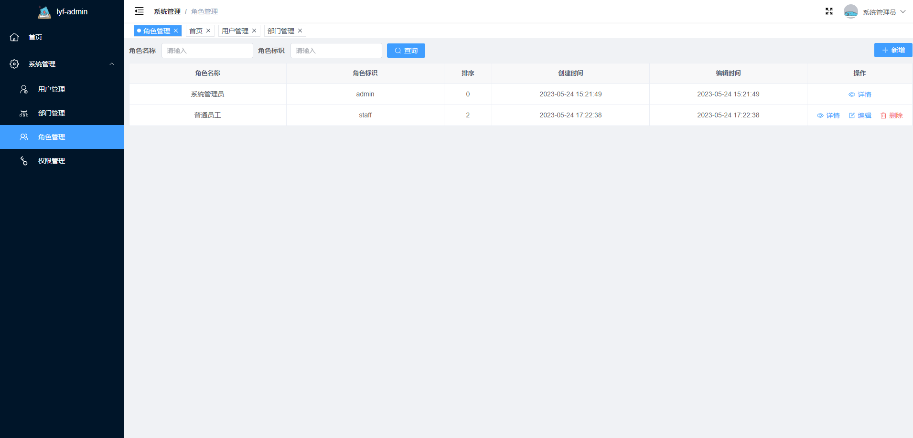

# lyf-vue-nest-admin

## 简介

采用 vue3+nestjs 构建的简易版后台管理系统。 

- 前端采用 Vite、Vue3、Pinia、Typescript、Element-Plus。
- 后端采用 NestJs、Prisma。
- 权限认证使用 Jwt。
- 数据库使用 PostgreSQL
   

## 本地开发

### 前端

<code>
  # 进入前端目录 
  cd lyf-ui 
  # 安装依赖 
  npm install 
  # 运行 
  npm run dev
</code

 

### 后端

默认使用 PostgreSQL 数据库，在 <code>.env</code> 文件中可以修改数据库类型、用户名、密码、地址、数据库名以及模式，详情见<a href="https://prisma.yoga/getting-started/setup-prisma/start-from-scratch/relational-databases/connect-your-database-typescript-postgres">Prisma 官方文档</a>

<code>
  #进入后端目录 
  cd lyf-admin 
  # 安装依赖 
  npm install 
  # 数据库迁移（创建数据库表） 
  npm run migrate:dev 
  # 数据库执行初始化权限表sql文件 
  ./db/permission.sql 
  # 运行 
  npm run start:dev 
</code>

 

## 功能

- 用户管理：系统用户的维护。
- 部门管理：组织架构的维护。
- 角色管理：系统内部角色的维护，通过配置对应的权限，可进行前端菜单、操作按钮以及后端接口的限制。
- 权限管理：系统内权限的维护，根据系统内的菜单、按钮以及接口创建对应的权限。

 

## 系统截图

  
  
  
  
  
  
  
  

